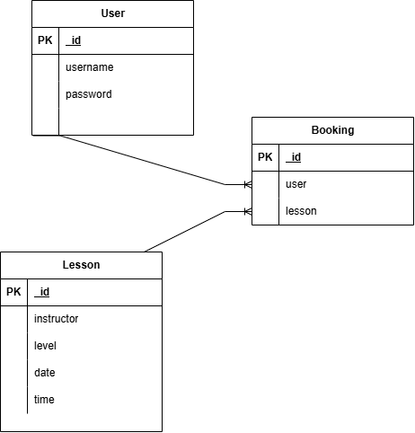

# Blue Wave 🌊🐋

## Overview

Blue Wave is a surfing lesson booking website where visitors can browse available surfing lessons and view details such as the date, time, level, and instructor. Visitors can choose a lesson and click to book it, but they must sign in or create an account before completing the booking. After booking, users can view, edit, or cancel their own bookings.

---

## Technologies Used

* HTML
* CSS
* JavaScript
* EJS
* Node.js
* Express
* MongoDB
* Mongoose

---

## User Stories

### Authentication

* As a user, I want to create an account so that I can book a surfing lesson.
* As a user, I want to log in so that I can manage my bookings.
* As a user, I want to log out so that my account remains secure.

### Lessons

* As a visitor, I want to view all available surfing lessons so that I can choose a lesson.
* As a visitor, I want to view the details of a surfing lesson so that I can decide if it is right for me.

### Bookings

* As a user, I want to book a surfing lesson so that I can reserve a spot.
* As a user, I want to view my bookings so that I can keep track of my lessons.
* As a user, I want to edit my booking so that I can change my booking details.
* As a user, I want to cancel my booking so that I can remove a lesson I no longer want.

---

## Database Design

---
## Database Design

### User

| **User**   |   |
| ---------- | - |
| `_id`      |   |
| `username` |   |
| `password` |   |

### Lesson

| **Lesson**   |   |
| ------------ | - |
| `_id`        |   |
| `date`       |   |
| `time`       |   |
| `level`      |   |
| `instructor` |   |

### Booking

| **Booking** |   |
| ----------- | - |
| `_id`       |   |
| `user`      |   |
| `lesson`    |   |

### Relationships

One user can have many bookings. One lesson can have many bookings. Each booking belongs to one user and one lesson.

---
