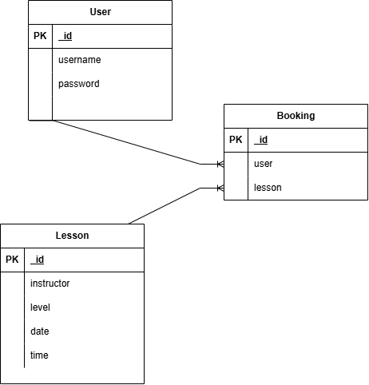

# Blue Wave 🌊🐋

## Overview

Blue Wave is a surfing lesson booking website where visitors can browse available surfing lessons and view details such as the date, time, level, and instructor. Visitors can choose a lesson and click to book it, but they must sign in or create an account before completing the booking. After booking, users can view, edit, or cancel their own bookings.

---

## Technologies Used

* HTML
* CSS
* JavaScript
* EJS
* Node.js
* Express
* MongoDB
* Mongoose

---

## User Stories

### Authentication

* As a user, I want to create an account so that I can book a surfing lesson.
* As a user, I want to log in so that I can manage my bookings.
* As a user, I want to log out so that my account remains secure.

### Lessons

* As a visitor, I want to view all available surfing lessons so that I can choose a lesson.
* As a visitor, I want to view the details of a surfing lesson so that I can decide if it is right for me.

### Bookings

* As a user, I want to book a surfing lesson so that I can reserve a spot.
* As a user, I want to view my bookings so that I can keep track of my lessons.
* As a user, I want to edit my booking so that I can change my booking details.
* As a user, I want to cancel my booking so that I can remove a lesson I no longer want.

---

## Database Design

---
## Database Models

### User

| Field      | Type     | Required |
| ---------- | -------- | -------- |
| `_id`      | ObjectId | Yes      |
| `username` | String   | Yes      |
| `password` | String   | Yes      |

### Lesson

| Field        | Type     | Required |
| ------------ | -------- | -------- |
| `_id`        | ObjectId | Yes      |
| `date`       | String   | Yes      |
| `time`       | String   | Yes      |
| `level`      | String   | Yes      |
| `instructor` | String   | Yes      |

### Booking

| Field    | Type     | Required |
| -------- | -------- | -------- |
| `_id`    | ObjectId | Yes      |
| `user`   | ObjectId | Yes      |
| `lesson` | ObjectId | Yes      |

---
## Routes

| Method | Route | Description |
|--------|-------|-------------|
| GET | / | Home page |
| GET | /lessons | View all surfing lessons |
| GET | /bookings | View my bookings |
| POST | /bookings | Create a booking |
| GET | /bookings/:id/edit | Edit booking form |
| POST | /bookings/:id | Update a booking |
| POST | /bookings/:id/delete | Cancel a booking |
| GET | /auth/sign-up | Sign-up page |
| POST | /auth/sign-up | Create an account |
| GET | /auth/sign-in | Login page |
| POST | /auth/sign-in | Log in |
| GET | /auth/sign-out | Log out |

## Features
toast
## Future Enhancements
 Add an admin dashboard
## Credits
 General Assembly instructors and course materials